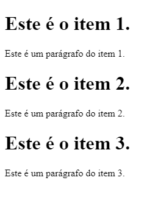

# Flexbox - display: flex

Aqui iremos aprender um pouco sobre o display: flex (ou Flexbox), uma propriedade muito importante nos dias de hoje, usado comumente na maioria dos sites e que nos ajuda demais durante o desenvolvimento do projeto.

## O que é o Flexbox

O flexbox é uma forma de organização de layout do nosso projeto. Essa organização pode ser feita de duas formas, seguindo padrão de linhas (_row_) ou de colunas (_column_).

## O que iremos desenvolver nesse módulo


## Como o flexbox funciona

Como citado acima, o flexbox pode funcionar tanto em linha quanto em coluna. Pra gente começar a mexer com o flexbox, precisaremos dar um `display: flex;` no nosso elemento pai.

Vamos usar como exemplo o seguinte elemento HTML.

```<div class="flexbox">
  <div class="item-1">
    <h1>Este é o item 1.</h1>
    <p>Este é um parágrafo do item 1.</p>
  </div>
  <div class="item-2">
    <h1>Este é o item 2.</h1>
    <p>Este é um parágrafo do item 2.</p>
  </div>
  <div class="item-3">
    <h1>Este é o item 3.</h1>
    <p>Este é um parágrafo do item 3.</p>
  </div>
</div>
```

No momento, esse é o resultado que temos.




## Referências

- [Conceitos básicos do Flexbox](https://developer.mozilla.org/pt-BR/docs/Web/CSS/CSS_Flexible_Box_Layout/Conceitos_Basicos_do_Flexbox)
- [A Complete Guide to Flexbox](https://css-tricks.com/snippets/css/a-guide-to-flexbox/)
- [Guia Completo de Flexbox](https://origamid.com/projetos/flexbox-guia-completo/)
